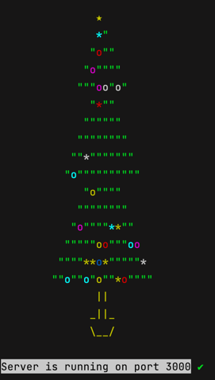

# algorithms-ts
node.js + Typescript 재미삼아 알고리즘 풀이



## TypeScript

> TypeScript, 마이크로소프트에서 개발한 오픈소스 프로그래밍 언어, 자신이 원하는 Type을 정의하고 프로그래밍을 하면 JavaScript로 컴파일되어 실행할 수 있다.

## Setup

`npm init`

`npm install -g typescript`

TypeScript 컴파일은 `tsc` 커맨드 사용
`tsc --init`

`tsconfig.json`

```json
{
  "compilerOptions": {
    "lib": [
      "es2021.intl"
    ],
    "target": "es2021",
    "module": "CommonJS",
    "moduleResolution": "Node",
    "outDir": "dist",
    "emitDecoratorMetadata": true,
    "experimentalDecorators": true,
    "sourceMap": true
  },
  "exclude": [],
  "include": [
    "src/**/*"
  ]
}
```

```shell
npm install --save-dev nodemon ts-node
```

`package.json`에 scripts 추가
```json
{
  "scripts": {
    "test": "echo \"Error: no test specified\" && exit 1",
    "start": "nodemon - exec ts-node src/index.ts"
  }
}

```

---

## express install

```shell
npm install express
```

`src/index.ts`

```typescript
import * as express from 'express';

class App {
    public application: express.Application;

    constructor() {
        this.application = express();
    }
}

const app = new App().application;

app.get("/", (req: express.Request, res: express.Response) => {
    res.send("hello world");
})
app.listen(3000, () => {
    console.log("Server is running on port 3000");
})
```
